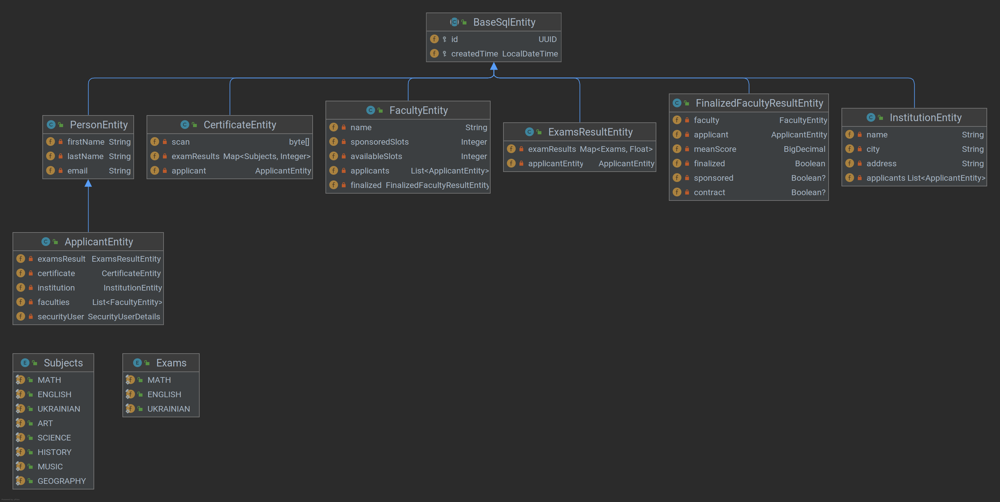
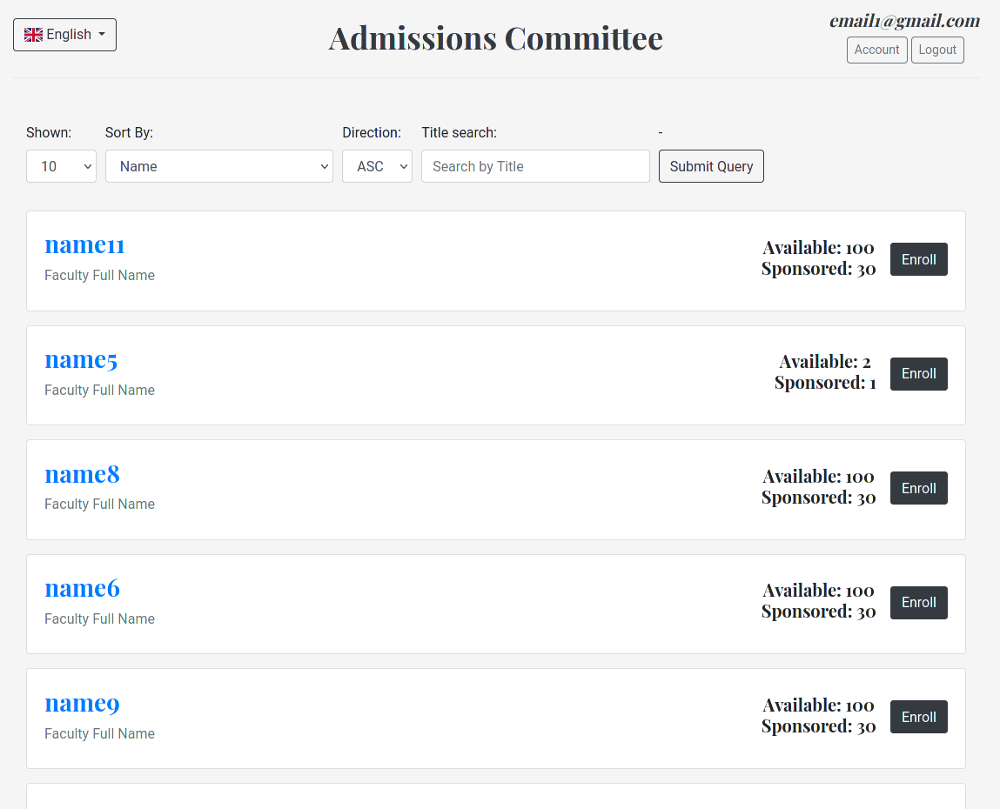
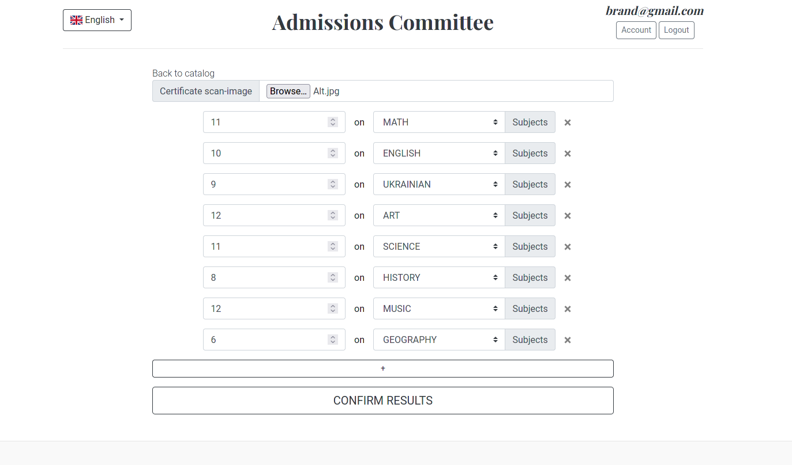
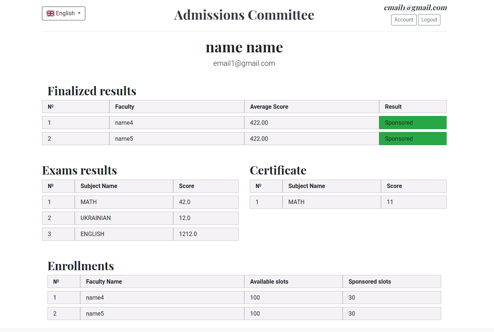
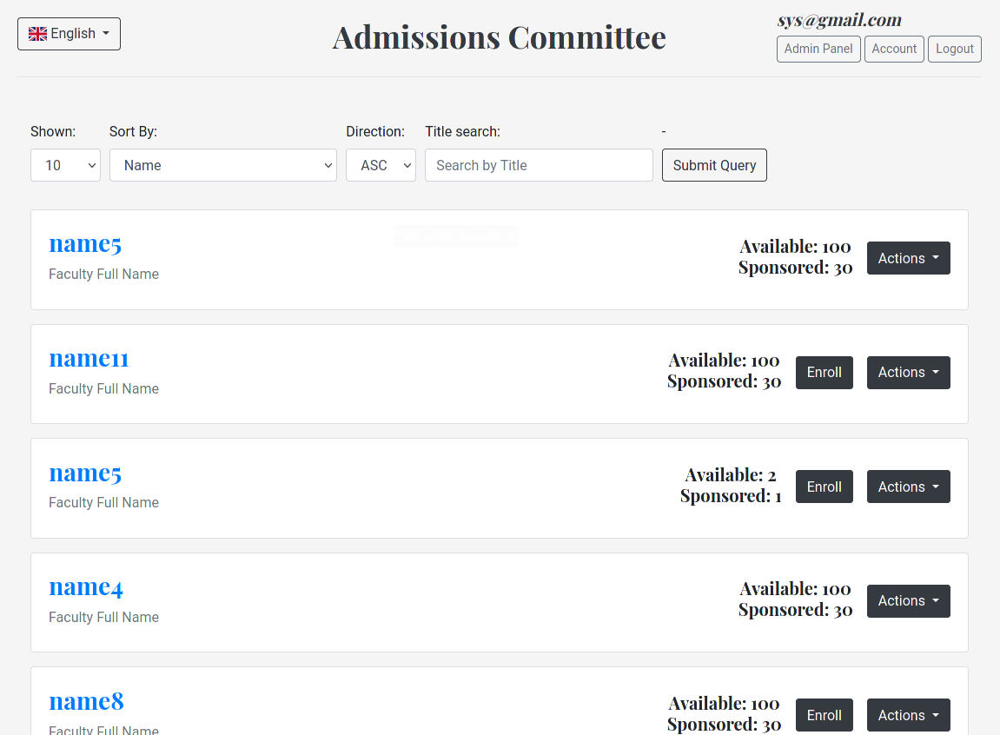

# ADDMISSIONS COMMITEE PROJECT
## Overall look up on the task
The system has a list of faculties for which it is necessary to implement the possibility of sorting:
- by name (a-z, z-a);
- by the number of budget places;
- by the total number of seats.

The entrant is registered in the system. During registration it is necessary to enter full name, email, city,
region, name of educational institution (optional: attach a scan of the certificate with grades).
The entrant can register for one or more faculties. When registering at
faculty student enters the results of relevant subjects, as well as grades from the certificate.
The system administrator has the rights to:
- adding, deleting or editing faculty;
- blocking or unlocking the entrant;
- adding the results of entrants to the Statement;
- finalization of Information for enrollment.

After finalizing the information, the system calculates the amount of points and determines the entrants enrolled
to the educational institution for budget places, for a contract. (Optional to add notifications about
the result of enrollment in a particular form of education, as well as non-enrollment with assistance
sending an email to the entrant). 

## Entities Class diagram

## Screenshots

